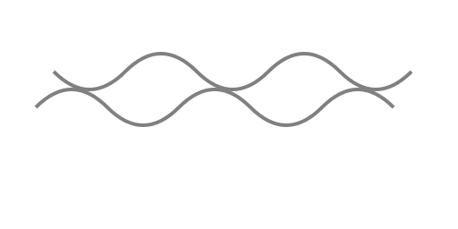

# Dragon Iconography

The `images/` subfolder (currently empty because external downloads are blocked in this environment) is intended to store public‑domain or Creative Commons depictions of dragons. The following sources may be added:

| Suggested File | Description & Source | License |
|---|---|---|
| `nine-dragons-scroll.jpg` | Section of the *Nine Dragons* handscroll by Chen Rong (1244), Museum of Fine Arts, Boston. [Wikimedia Commons](https://commons.wikimedia.org/wiki/File:Chen_Rong_-_Nine_Dragons_scroll_-_Google_Art_Project.jpg) | Public domain |
| `imperial-dragon-flag.png` | Imperial dragon flag of the Qing dynasty (1889–1912). [Wikimedia Commons](https://commons.wikimedia.org/wiki/File:Flag_of_the_Qing_dynasty_(1889-1912).svg) | Public domain |

Each image should be downloaded to `images/` and accompanied by an attribution note referencing its source and license.
=======
# Chinese Dragon Iconography

Chinese dragons symbolize power and auspiciousness. Two common motifs are shown below.

## Five-Clawed Dragons
Imperial dragons are depicted with five claws, a symbol reserved for the emperor and central authority. The five-claw standard was codified during the [Qing dynasty](../Historical-Timeline/README.md#qing-dynasty), with princes and officials limited to four or three claws.

*Figure 1. Stylized five-clawed dragon. Image created by ChatGPT; licensed [CC0 1.0](https://creativecommons.org/publicdomain/zero/1.0/).* 

## Cloud Scrolls
Cloud scrolls (yunwen) represent celestial movement and often accompany dragons in art, filling backgrounds with swirling energy.

*Figure 2. Cloud scroll pattern. Image created by ChatGPT; licensed [CC0 1.0](https://creativecommons.org/publicdomain/zero/1.0/).* 
